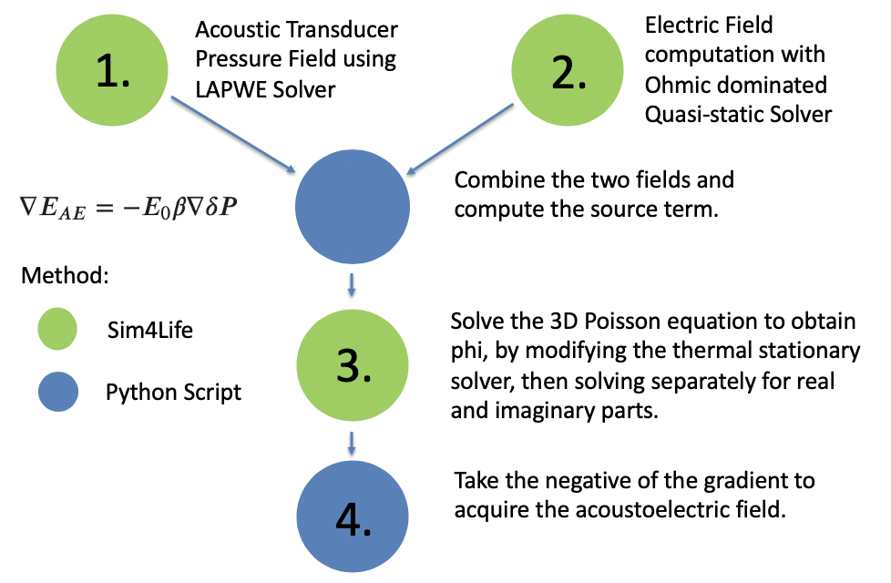
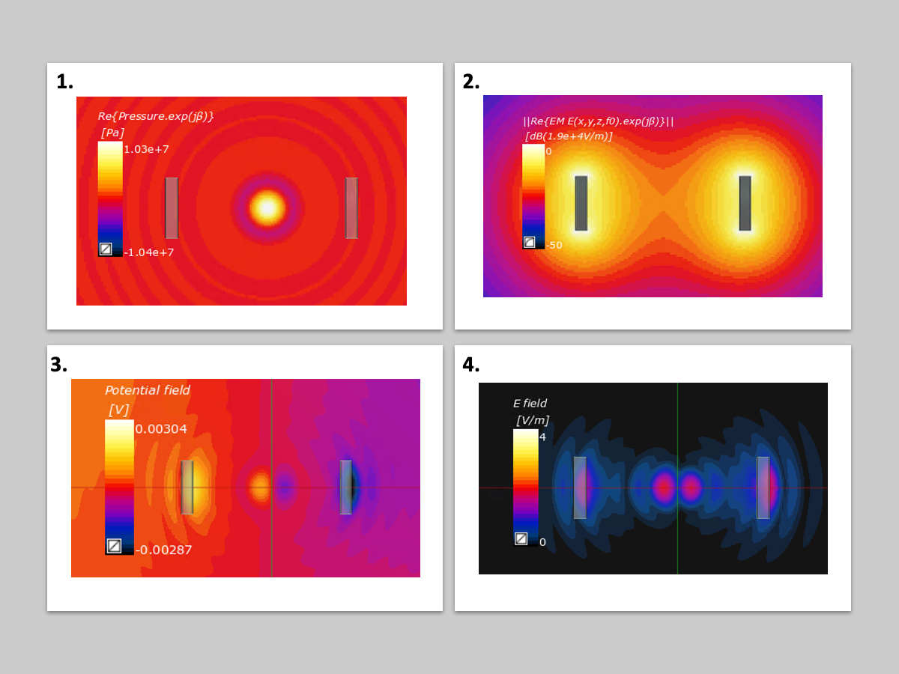
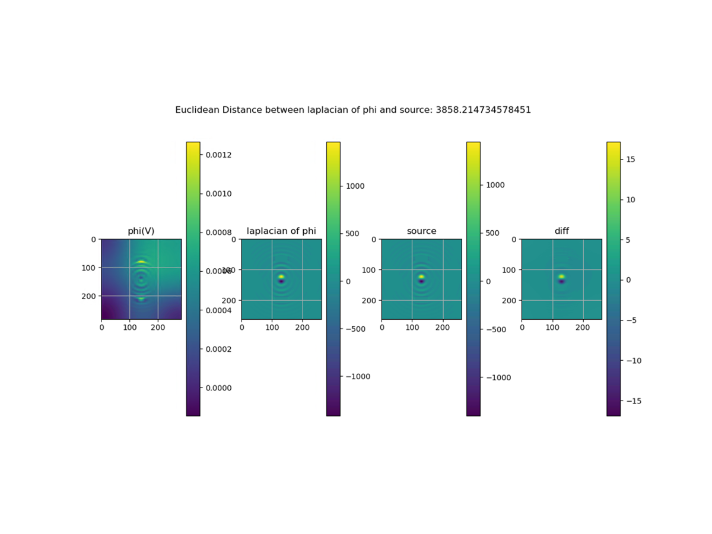
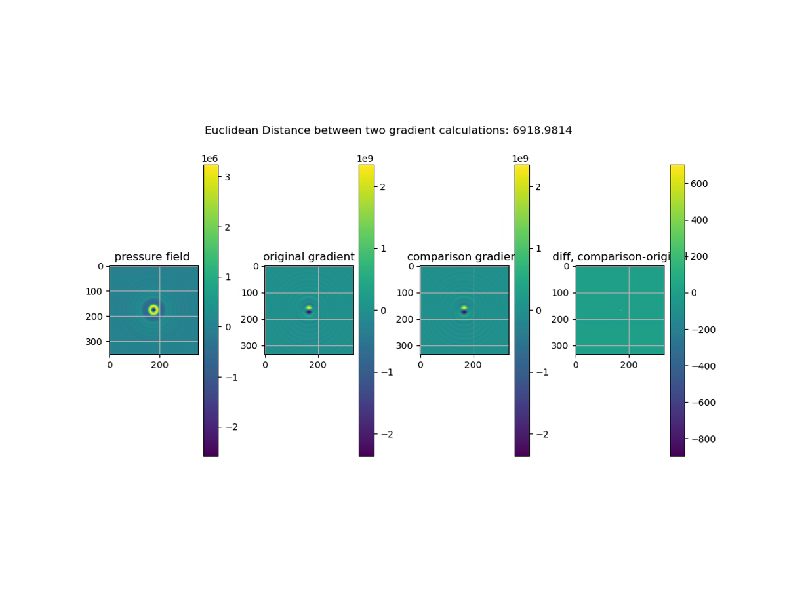
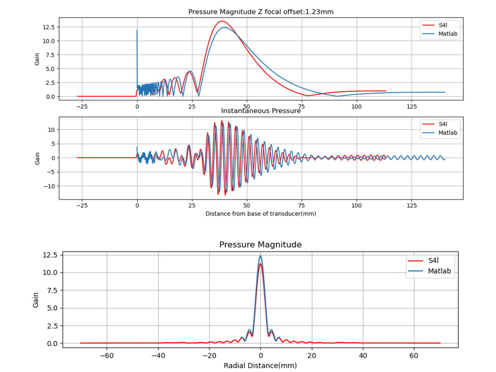
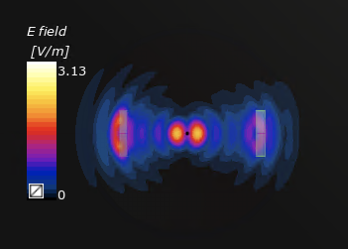
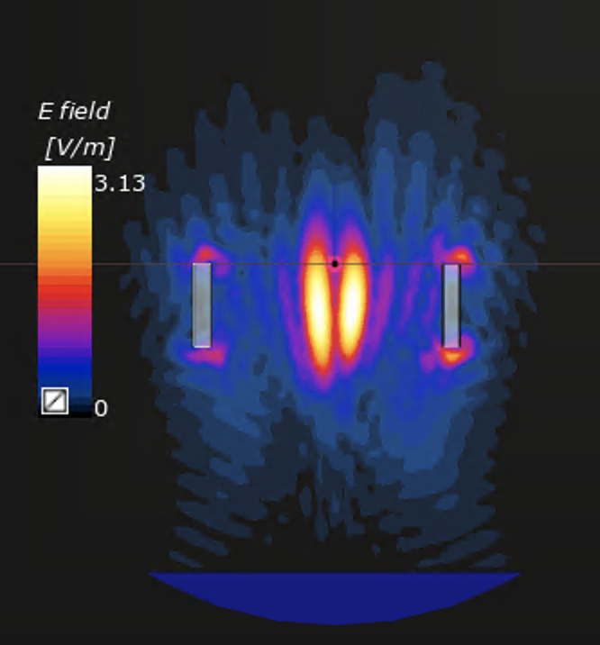

# ATI - Acoustoelectric Simulation

This repository contains all files required to simulate the acoustoelectric effect in a non-homogeneous medium. The simulation is made of 4 parts which solve the equation shown in the below flow chart. 

	

## Results Description
1 through 4 refer to the simulation results from each of the above listed Sim4Lifesimulations in the flowchart. 

	

1. Pressure field simulation of single element focused transducer. 
2. Dipole simulation using Ohmic Dominated Quasistatic Solver
3. Phi result after the real and imaginary diffusion solvers have been run. 
4. The resultant electric field generated by the acoustoelectric effect, and the negative gradient of phi. 

## Acoustoelectric Sim4Life Simulation

* Questions: Jean Rintoul
* Email: jeanrintoul@imperial.ac.uk

## Structure: 
The Acoustoelectric Simulation Consists of a 4 simulation pipeline. 

1. The acoustic and EM dipole simulation should be run. 
2. Run acoustoelectric.py through the S4L scripter. Note that this script calls out to an external python 3 process to compute the gradient of pressure correctly. If you do not have python 3 installed on your path you will need to do this to run the script successfully. All interim quantities are stored out to NPZ files separately, to enable easy checking at every step. 
When the script has finished running, 'success!' will be written in the consol in s4l, and in the analysis tab you will see the two source terms. One source term is called 'real part diffusion', the other is 'imag part diffusion'. 
3. To run the diffusion, we compute the result for real and imaginary parts separately. In the simulation tab, in 'Image_Diffusion' simulation, import an analysis source. When you do this, you should see 'imag part diffusion' in the option for sources to import. Similarly for the 'Real_Diffusion'. Once you have ensured that both diffusion sims have the correct source term, run them.
4. Once both diffusion simulation have completed, from the scripter run 'join_ae_field'. This also calls out to an external python 3 process to compute a gradient term, and will also re-import the resultant phi and AE field into the analysis. 
5. Switch to the analysis tab and add a slice viewer to the Acoustoelectric Voltage field, and the Acoustoelectric E field(note this is the magnitude sqrt(E_x^2+ E_y^2+E_Z^2) and note a vector field).

Other files for verification and residual analysis: 
- poisson verification.py. This file takes in the resultant phi, calculates the laplacian and compares it with the source term. 

	

- gradient verification. This file takes in the pressure field, the gradient calculated by numpy in python 3, and compares it against a central difference calculation of the gradient term, thereby verifying the gradient calculation. 

	

- acoustic_accuracy_test.py- this file was used to assess the accuracy of the acoustic simulation in comparison to the output of the analytic solution focused.m. The acoustic_accuracy_test_exporter can be run from within s4l once the acoustic simulation is complete, to export the results ready to plot. 

	

## Resultant acoustoelectric field 

	
	

