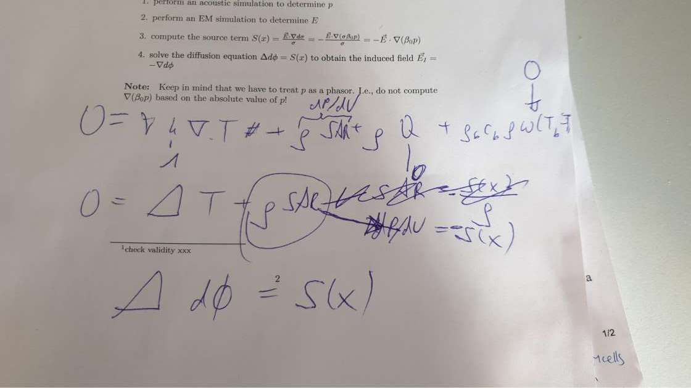

# ATI - Acoustoelectric Temporal Interference

This repository will contain the smash files from SIM4Life and python code to create a simulation of Acoustoelectric Temporal Interference. 

The basic concept is to utilize the acoustoelectric effect, whereby an acoustic wave causes a localized change in conductivity in a medium to create an oscillating electric field, which can then be used in TI stimulation. The advantage of this is the smaller focal point of the acoustic transducer, enabling a more localized electrical stimulation. 

## Intall environment

Jean is running a Windows 10 machine(through VMWare) with Sim4LifeLight 5.2.1.1375 installed. The lab server based full version is available later when more complex models are used. 

## Model Description
For the feasibility test the following model will be used: 

	

The images folder in this repository contains the original proposal, as well as Esra's initial mathematical outline of steps to set up in the the processing pipeline.

A good paper is: 
X. Song, Y. Qin, Y. Xu, P. Ingram, R. S. Witte and F. Dong, "Tissue Acoustoelectric Effect Modeling From Solid Mechanics Theory," in IEEE Transactions on Ultrasonics, Ferroelectrics, and Frequency Control, vol. 64, no. 10, pp. 1583-1590, Oct. 2017.

## Goal
We desire a python processing pipeline which runs from acoustic simulation through to TI simulation. 

## Specifications: 
### Step 1: Acoustic Simulation
There is a very basic simualtion in place. 

### Step 2: Electric Lead Field Simulation 
There is a very basic simulation in place. 

### Step 3: Compute the source term S(x)
The main question I have is about the real part of the result of step 3 which is fine for visualizing, but won't work in a transient thermal diffusion solver. Should I be calculating the source in terms of the complex field? Otherwise I would solve the diffusion equation for a static thermal solver. Currently you'd expect a sinusoidal volume, conductivity and pressure change over time. 

### Step 4: Solve the diffusion equation 

	

