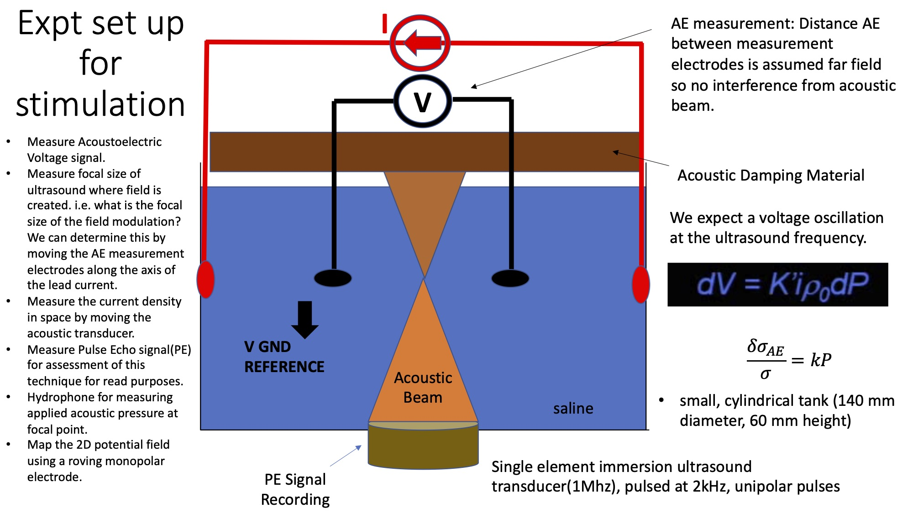

# ATI - Acoustoelectric Temporal Interference

This repository will contain the smash files from SIM4Life and python code to create a simulation of Acoustoelectric Temporal Interference. 

The basic concept is to utilize the acoustoelectric effect, whereby an acoustic wave causes a localized change in conductivity in a medium to create an oscillating electric field, which can then be used in TI stimulation. The advantage of this is the smaller focal point of the acoustic transducer, enabling a more localized stimulation focal point. 

## Intall environment

Jean is running a Windows 10 machine(through VMWare) with Sim4LifeLight 5.2.1.1375 installed. The lab server based full version is available later when more complex models are used. 

## Model Description
For the feasibility test the following model will be used: 

	

The images folder in this repository contains the original proposal, as well as Esra's initial mathematical outline of steps to set up in the the processing pipeline.

## Goal
We desire a python processing pipeline which runs from acoustic simulation through to TI simulation. 

## Specifications: 
### Step 1: Acoustic Simulation
Currently, I've got the SEFT tutorial at transducer frequency of 55kHz, with a sinusoidal pulse. Is it possible to run through a unipolar pulse instead? So it's a 55kHz transducer modulating at 2kHz with a unipolar pulse? This would be a common set up for tumor ablation-though we are using it for a different purpose. We would expect this to have a frequency response at the 55kHz frequency, the 2kHz frequency, and the mixing frequencies(though we could ignore the mixing for now if it is too complex). 

Example Unipolar waveform = 0.5*(sin(2\*pi\*fs\*t)+|sin(2\*pi\*fs\*t) | )

The python script - unipolar_model.py can generate a unipolar waveform and plot it. I was using this to then plug into the equation area in sim4life. When I do this, it causes problems however. 

Question: When I try to plot the results of pressure or intensity vs time, I can only get a single time point or one dot on the graph. Why is this? How do I plot the pressure over time?

### Step 2: Electric Lead Field Simulation 
- I've selected the Electrostatic simulation. Is this correct?
- How do I place Voltage sensors in the two inserted cylindrical leads? I cannot see it on any menu... todo. 
- which part of this do i export, and how do i convert this simulation into a python script?

### Step 3: Compute the source term S(x)

### Step 4: Solve the diffusion equation equation

